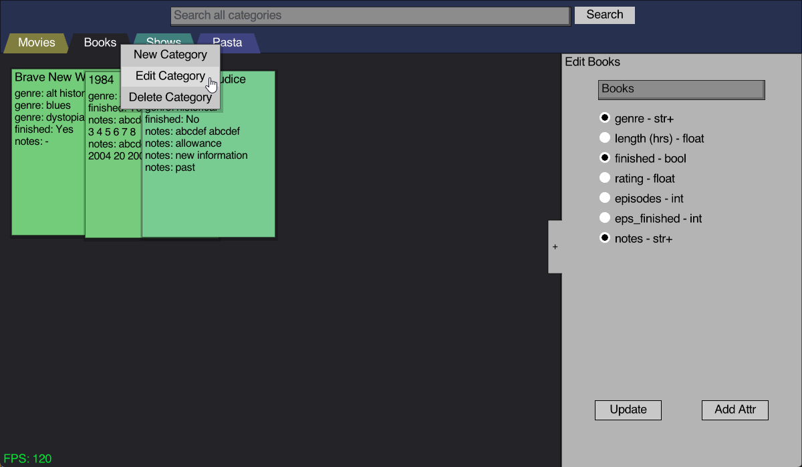

## RayEAV

EAV db system setup with sqlite3, and raylib for GUI.

Also running a custom UI library I'm implementing for raylib,
though its not quite modular enough (yet) to fully separate from the project.

The advantage of sqlite is that it's designed to be embedded into applications,
removing the need for running a separate MySQL instance in the background.

### Usage
- Entities are grouped by category
- Attributes are shared per category
- Attributes define what type of value they take as an input
- Valid value types: int, float, str, bool
- int and float values can optionally have units displayed next to their values
- search bar supports searching for values with the format "{attr}: {value}"
- numerical values can be compared with "{attr} > {value}" / "{attr} < {value}"
- unfilled fields can be found with "{attr}: _empty"
- multiple search parameters can be separated with commas
- treat multiple filters as OR instead of AND by appending the search with "(or) ..."
- filter for only 1 category with "@{category}, ..."

### Future Ideas
- scrolling text on cards
- optimize multi search

## Installation (with MSYS2)
- Go through setup process to get mingw compiler working with VSCode (https://code.visualstudio.com/docs/languages/cpp)
- Search for raylib package in mingw repository `pacman -Ss raylib`
- Copy package name that matches g++ version (default is ucrt64)
- Install package with `pacman -S {...}`
- create an empty "main.db" file in the root folder
- (FYI: `-lraylib -lsqlite3` flag was added to tasks.json manually)

Note: there's a `src/font.c` and `src/icon.c` resource file missing from the repo.
These files are generated through raylib using the `ExportFontAsCode()` and `ExportImageAsCode()` functions.
The unconverted files are included in `/assets`.

## Release
- This is for compiling a release version of the project, packaging dependencies into the .exe
- Will result in a longer compile time
- Download raylib sources files to default location (C:/raylib/raylib/src)
- Note: Can get raylib source code from https://www.raylib.com/
- Run `./release.bat`
